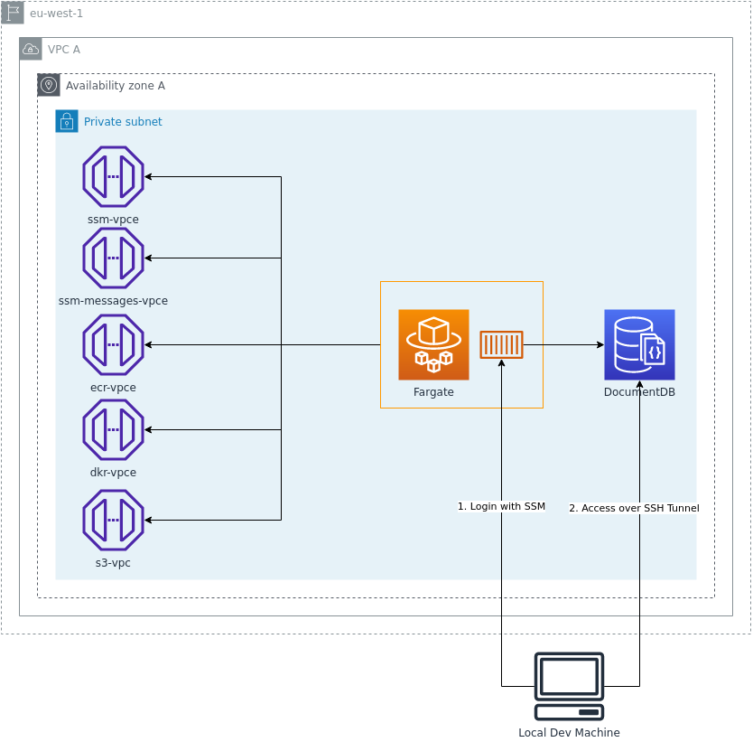

# CDK - ECS-SessionManager-SSH-Example

## Use Case

Sometimes it is needed to access an ecs fargate task for debugging purpose, or you have the need to access private aws resources (i.e. document db in private subnet). This example describes the mechanism to access an ecs task and how you can establish an ssh tunnel to access private aws resources from your local machine. This example will use a document db to illustrate the usage.

All needed resources will be described in detailed in the following steps and the cdk code ;)

## Checkout

Please use `git clone --recursive -j8 git@github.com:baracs21/aws-examples.git`, because this repository uses git submodules.

## Pre-Conditions

- aws cli
- aws sessionmanager plugin
- jq
- taskfile

## References

- https://docs.aws.amazon.com/systems-manager/latest/userguide/session-manager-working-with-install-plugin.html
- https://docs.aws.amazon.com/systems-manager/latest/userguide/session-manager-working-with-sessions-start.html

## Notes

ECS Target: ecs:ClusterName_task_runtimeId
